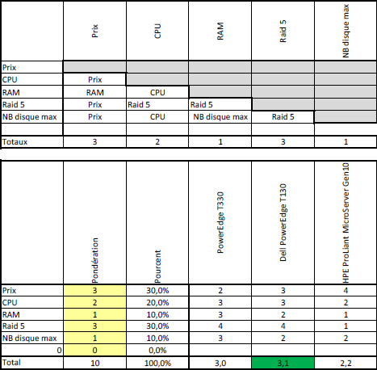

# Document de planification de la migration - ScuolaPro

<!-- TOC depthFrom:1 depthTo:6 withLinks:1 updateOnSave:1 orderedList:0 -->

- [Document de planification de la migration - ScuolaPro](#document-de-planification-de-la-migration-scuolapro)
	- [Introduction](#introduction)
	- [Migration des données](#migration-des-donnes)
		- [Méthode 1 - Via supports externes](#mthode-1-via-supports-externes)
		- [Méthode 2 - Transfère via le réseau](#mthode-2-transfre-via-le-rseau)
		- [Méthode 3 - Déplacer les disques durs](#mthode-3-dplacer-les-disques-durs)
	- [Migration des services](#migration-des-services)
		- [Méthode 1 - Replications](#mthode-1-replications)
		- [Méthode 2 - Copie des données des services](#mthode-2-copie-des-donnes-des-services)
	- [Choix des méthodes](#choix-des-mthodes)
		- [Conclusion](#conclusion)
	- [Matériel](#matriel)
		- [Prérequis matériel Windows Server 2012 R2](#prrequis-matriel-windows-server-2012-r2)
			- [Note](#note)
		- [Matériel Serveur Actuelle](#matriel-serveur-actuelle)
		- [Analyse matériel](#analyse-matriel)
		- [Solutions](#solutions)
			- [Solution 1](#solution-1)
				- [Aventage](#aventage)
				- [Inconvénient](#inconvnient)
			- [Solution 2](#solution-2)
				- [Aventage](#aventage)
				- [Inconvénient](#inconvnient)
			- [Solution 3](#solution-3)
				- [Aventage](#aventage)
				- [Inconvénient](#inconvnient)
			- [Choix final](#choix-final)
				- [Justification financière](#justification-financire)
				- [Matériel nouveau serveur](#matriel-nouveau-serveur)

<!-- /TOC -->

## Introduction

Planification de la migration du Windows Server 2003 vers un Windows Server 2012 R2.
Le matériel, les données et les services devront, dans la mesure du possible, être migrés sans interruption de service.

## Migration des données

Nous proposons 3 méthodes différentes pour la migration des données.

### Méthode 1 - Via supports externes

Utiliser un média externe (clé USB, disque dur externe, etc...) sur lequel on copie les données du Windows Server 2003 afin de pouvoir les transférer sur le Windows Server 2012 R2.

|Avantages|Inconvénients|
|---------|-------------|
| - Ne nécessite pas de mettre en place un quelconque système|- Transfère assez long suivant la taille des données   - Si les utilisateurs modifies certaines données durant le transfère, ces modification seront perdues |

### Méthode 2 - Transfère via le réseau

Transférer les données via le réseau en utilisant les partages. Cet opération peut être automatisée avec un script, qui sera exécuté durant la nuit lorsque plus personne ne sera amenée à utilisé ces données.

|Avantages|Inconvénients|
|---------|-------------|
|- Automatisé avec un script|- Limité par la vitesse du réseau|

### Méthode 3 - Déplacer les disques durs

Déplacer directement les disques durs contenant les données sur le Windows Server 2012 R2.

|Avantages|Inconvénients|
|---------|-------------|
|- Transfère rapide   - Pas besoin de racheter des disques durs|- Les données sont temporairement indisponible   - Nécessite une interuption des services|

## Migration des services

Nous proposons 2 méthodes différentes pour la migration des services.

### Méthode 1 - Replications

Répliquer les services (DNS, DHCP, AD) et dupliquer les partages sur le nouveau serveur. Il faut pour cela mettre en place le nouveau serveur, le promouvoir en contrôleur de domaine, pratiquer la replication, dépromouvoir l'ancien serveur.
Le nouveau serveur reprendra l'entière responsabilité des services. Cette méthode permet une migration sans interuption de service.

|Avantages|Inconvénients|
|---------|-------------|
|- Pas d'interruption de service| - Long à mettre en place (il faut paramétrer les réplications sur tous les services et vérifier leur fonctionnement)|

### Méthode 2 - Copie des données des services

Copier et déplacer les bases de données AD, DNS et DHCP vers le nouveau serveur et les importer dans les nouveaux services. Il faut pour cela mettre en place le nouveau serveur et y installer les services. Pour pouvoir copier correctement les bases de données il faut stopper les services, ce qui ne garanti par une migration sans interruption de service.

|Avantages|Inconvénients|
|---------|-------------|
|- Plus rapide à mettre en place| - Ne garanti pas une migration sans interruption de service|

## Choix des méthodes

Nous testerons les méthodes 2 et 3 pour la migration de donnée et les méthodes 1 et 2 pour la migration des services.

Attributions des méthodes :
|Nom|Prénom|Méthode Données|Méthode service|
|---|------|---------------|---------------|
|Aellen|Quentin|3|2|
|Niclass|Dorian|2|1|

### Conclusion

Après la mise en pratique de chaques méthodes, nous avons opté pour la méthodes 2 pour la migration des données et la méthode 1 pour la migration des services en tant que mthodes les plus efficaces.

## Matériel
### Prérequis matériel Windows Server 2012 R2
Windows server 2012 R2 à besoin au minimum :
* CPU : 1.4 GHz 64-Bit
* RAM : 512 Mo
* Disque : 32 Go
* Carte réseau : 10/100/1000baseT

#### Note
Windows Server 2012 R2 aura besoin de plus de place sur le disque dur si il y a 16 Go de RAM ou plus installé pour la mémoire tampon, etc...

### Matériel Serveur Actuelle
* CPU : Intel Xeon Processor E5450 3 Ghz
* Nombre de coeur : 4
* RAM : 512 Mo
* Disques durs :
    * Disque 1 : 40Go
    * Disque 2 : 40Go
    * Disque 3 : 40Go
    * Disque 4 : 40Go

### Analyse matériel
Le serveur respecte la configuration minimal nécessaire pour l'installation de Windows Server 2012 R2, mais du à son matériel et son ancienneté, il risque d'y avoir des ralentisements dans le système notament à cause du manque de RAM et la vitesse des disques durs.

### Solutions

#### Solution 1
Investisement dans du nouveau matériel.

##### Aventage
+ Rentable sur le long terme.
+ Contrôle sur les spécifications matériels.
##### Inconvénient
- Investisement important à la mise en place du serveur.
- Infrastructure adapté.
- Il faut revaloriser l'ancien matériel.

#### Solution 2
Hébergement dans le cloud.

##### Aventage
+ Coût matériel inexistant
##### Inconvénient
- Dépendant d'une infrastructure externe

#### Solution 3
Garder le même matériel est améliorers les composants

##### Aventage
+ Coût matériel faible
##### Inconvénient
- Migration plus compliqué

#### Choix final
Nous avons opté pour le remplacement de l'ancien serveur par un nouveau qui est le . Il faudra équalement un lot de 3 disques durs, ceux que l'on a choisit sont les  de 1 To. Nous aurons besoin aussi de  supplémentaire. Ce qui fait au total un coût de **985.20 fr**.

##### Justification financière
Par rapport à la matrice de comparaison avec les principales caractéristiques importantes nécessaires pour le fonctionnement de Windows server 2012 R2, nous somme arrivé à la conclusion que cette solution serait la meilleure.

On l'a choisi car il dispose des caractéristiques nécessaires pour un fonctionnement optimum de Windows Server 2012 R2 dans le cadre de l'entreprise Scuolapro et coûte relativement peu cher. A cela nous y ajoutons trois disques durs Western Digital Gold de 1 To pour pouvoir mettre en place

##### Matériel nouveau serveur
* CPU : Intel xeon e3 1220 v6
* Nombre de coeur : 4
* RAM : 8 Go
* Disques durs :
    * Disque 1 : 1000 Go
    * Disque 2 : 1000 Go
    * Disque 3 : 1000 Go
    * Disque 4 : 1000 Go
