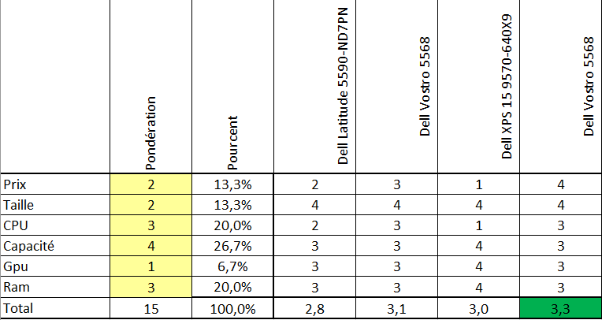
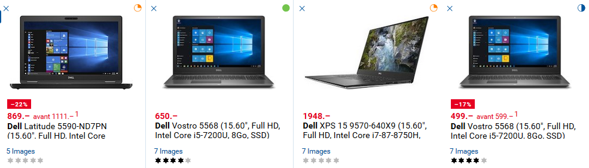
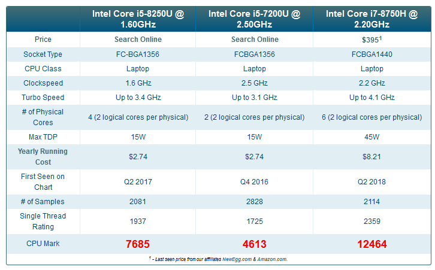
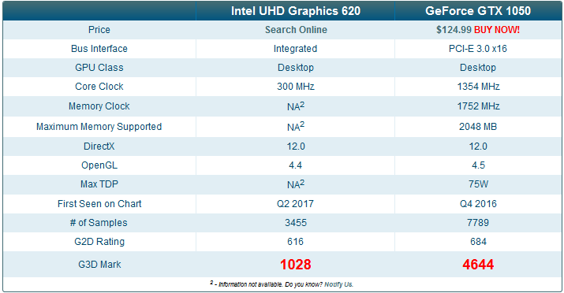

# Document de migration du client - ScuolaPro

## Introduction

Migrer les machines clientes vers Windows 10 en prennant compte de l'hardware, des logiciels et des pilotes.

## Logiciels

### Liste des logiciels

|Nom|Éditeur|Version installée|Dernière version|
|---|-------|-----------------|----------------|
|Bonjour|Apple Inc.|2.0.4.0|3.1.0.1|
|Adobe Acrobat Reader DC - Français|Adobe Systems Incorporated|15.017.20050|2019.010.20069|
|Gadwin PrintScreen (64-Bit)|Gadwin Systems|5.4.2.0|5.8|
|Avira Launcher|Avira Operations GmbH & Co. KG|1.2.71.21096|v|
|XMind 7.5 Update 1|XMind Ltd.|3.6.51.201607142338|3.7.2|
|Mozilla Maintenance Service|Mozilla|49.0.1|v|
|Mozilla Firefox|Mozilla|49.0.1|62.0|
|Avira Antivirus|Avira Operations GmbH & Co. KG|15.0.20.59|15.0.43|
|PDFCreator|pdfforge GmbH|2.3.2|3.3.2|
|UltraVnc|uvnc bvba|1.2.1.1|1.2.2.3|
|Module linguistique Microsoft .NET Framework 4 Client Profile Français|Microsoft Corporation|4.0.30319|v|
|Microsoft .NET Framework 4 Client Profile|Microsoft Corporation|4.0.30319|4.7.2|
|Microsoft Office Professional Edition 2003|Microsoft Corporation|11.0.5614.0|v|
|Microsoft Visual C++ 2008 Redistributable - x64|Microsoft Corporation|9.0.30729.6161|v|
|Microsoft Visual C++ 2008 Redistributable - x86|Microsoft Corporation|9.0.30729.4148|v|

## Matériel

Matériel obsolète pour Windows 10, choix du matériel de remplacement et justification.

### Justification
La configuration des ordinateurs portable et fixe suivant répondent aux critères de la configuration minimal de Windows 10.

Bien que les configurations soient compatibles avec windows 10, ça ne garantie pas des performances optimals pour leur fonctionnement.

## Choix matériel

Pour choisir le matériel adapté j'ai utilisé une matrice excel basé sur les critères que j'ai estimé important.

Voici la matrice en question :

Pour établire les scores je me suis basé sur la comparaison sur le site digitec disponible ,  , et sur des benchmarks l'un pour les processeures  et l'autre pour les carte graphique. 

Le choix final se portera sur le Dell vostro 5568 ayant un prix hors réduction de 599 fr.

## Solutions de migration

### Solution 1

Mise en place d'un système de déployement de système d'exploitation et de logiciel. Cette solution permet une administration centralisé et permet de facilement déployer de nouvelle version d'un logiciel.

### Solution 2

Installation manuel du système d'exploitation et mise à jour manuel des applications.
