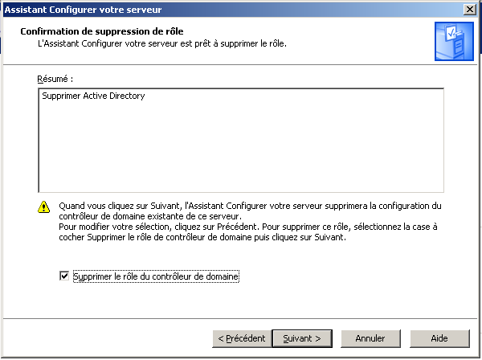

# POC - Migration des services

## Introduction

Migration des services de l'ancien serveur vers le novueau serveur. Pour ce faire, nous allons mettre en place le nouveau serveur en y installant tous les services et en l'ajoutant dans le domaine comme deuxième controleur de domaine afin d'y appliquer une replication des services.

## Mettre en place le nouveau serveur

### Configuration du serveur

* Nom : ICT158-SRV2012R2
* RAM : 8 Go
* disques durs : 4x 1 To

Paramètres réseaux :

* Adresse IP : 10.1.1.21
* Masque : 255.255.255.0
* Passerelle par défaut : 10.1.1.20
* Serveur DNS : 10.1.1.20

### Changer le niveau fonctionnel de la forêt

Pour pouvoir ajouter un Windows Server 2012R2 comme controleur de domaine, il faut que le niveau fonctionnel de la forêt soit d'au moin être Windows Server 2003,  ce qui n'est pas le cas (actuellement Windows Server 2000).

Augmenter le niveau fonctionnel du domaine:

1. Dans **Gérer votre serveur** sous **Contrôleur de domaine (Active Directory)** cliquer sur **Gérer les utilisateurs et les ordinateurs dans Active Directory**
2. Clique droit sur Scuolapro.local -> **Augmenter le niveau fonctionnel du domaine**  
  
3. Sélectionner Windows Server 2003  
  

Augmenter le niveau fonctionnel de la forêt :

1. Dans **Gérer votre serveur** sous **Contrôleur de domaine (Active Directory)** cliquer sur **Gérer les domaines et les approbations**
2. Clique droit sur Domaines et approbations Active Directory -> **Augmenter le niveau fonctionnel de la forêt**    
  
3. Sélectionner Windows Server 2003   
  

### Installer les services

#### Installation de l'AD

1. Ajouter le service AD DS sur le Windows Server 2012R2
2. Le configurer en tant que nouveau controler de domaine  
  
3. Installer le serveur DNS avec
4. Répliquer à partir du Windows Server 2003  
  
5. Laisser les chemins d'accès par défaut et terminer la configuration

#### Migration du DHCP

1. Ajouter le service DHCP sur le Windows Server 2012R2
2. Terminer la configuration, sans ajouter d'étendue
3. Exporter la configuration DHCP du Windows Server 2003 : **netsh dhcp server export C:\dhcp.txt 10.1.1.0**
4. Récupérer cette configuration sur le Windows Server 2012R2 depuis le partage C$ : \\10.1.1.20\C$
5. Importer la configuration : **netsh dhcp server import C:\dhcp.txt**

### Transmettre les rôles FSMO

Pour transférer les rôles FSMO verc ICT158-SRV2012R2, exécuter la commande suivante : **Move-ADDirectoryServerOperationMasterRole -Identity ICT158-SRV2012R -OperationMasterRole PDCEmulator, RIDMaster, InfrastructureMaster, SchemaMaster, DomainNamingMaster**

Pour vérifier le bon fonctionnement : **netdom query FSMO**

### Dépromouvoir le Windows Server 2003

Maintenant que le Windows Server 2012R2 est opérationnel pour prendre la relève, nous pouvons sortir l'ancien serveur du domaine.

1. Dans le gestionnaire de serveur, cliquer sur **Ajouter ou supprimer un rôle** et sélectionner **Contrôleur de domaine (Active Directory)**
  
2. Choisir de le supprimer  
  
3. Ne pas cocher la case **Ce serveur est le dernier contrôler de domaine du domaine**  
  
4. Terminer la désinstallation du service
