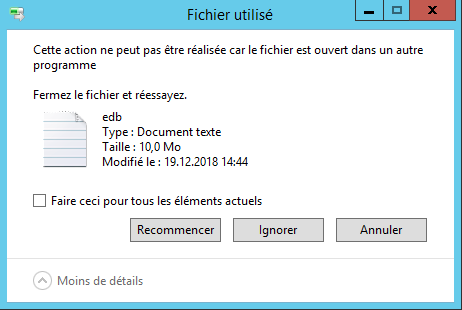
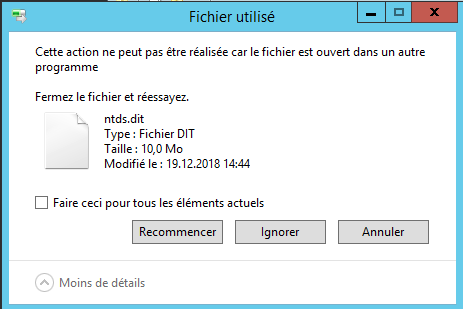
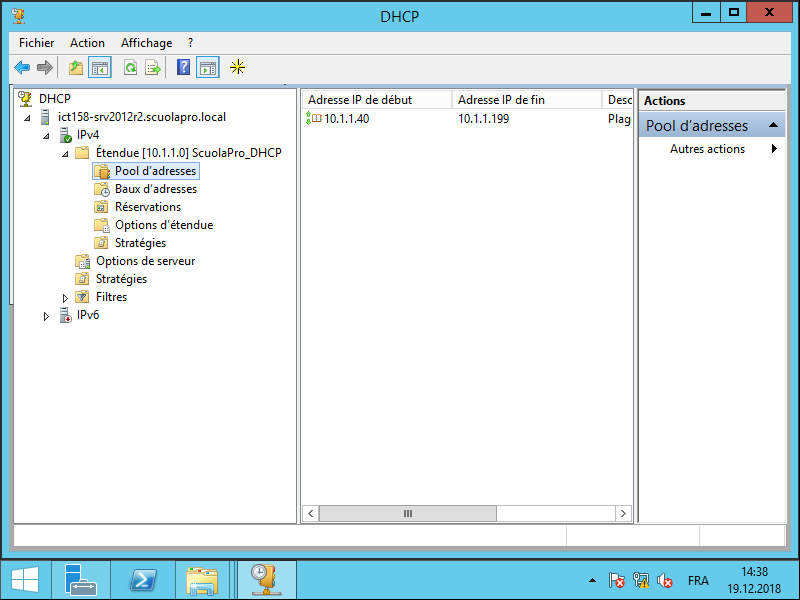
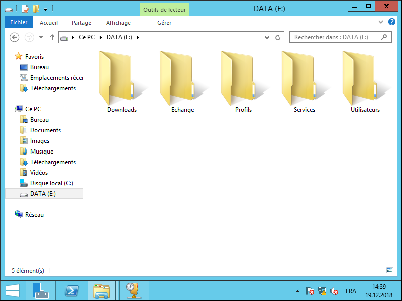
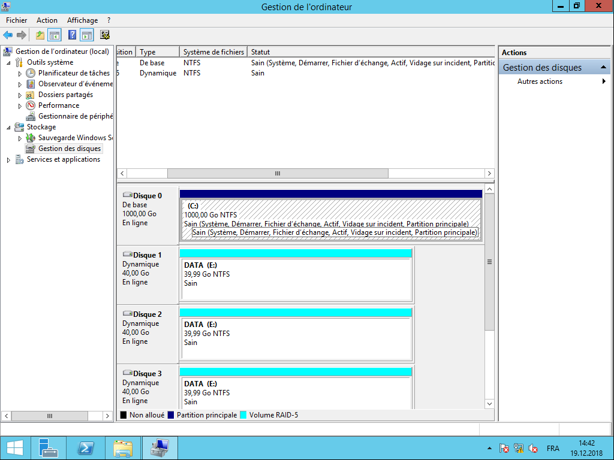

#POC - Migration des données (Déplacement des disques & copie des fichiers des services)
## Matériel nécessaire

* Ancien serveur
* Nouveau serveur avec windows server 2012 R2 préinstallé

## Migration des services

### Active directory
1. Mise en place du service active directory dans une nouvelle fôret ayant le même nom que l'ancien serveur

  * Nom de la forêt : Scuolapro.local
  * Niveau fonctionel de la fôret : Windows server 2012 R2
  * Niveau fonctionel du domaine : Windows server 2012 R2

2. Mise en arret du service remplacement des fichiers NTDS et SYSVOL de windows server 2012 R2 par ceux de windows server 2003 r2.

Problème de copie du à des fichiers utilisé par un service de windows server 2003 R2, je n'ai pas reussi à trouvé le service qui corresspont à ces deux fichiers abondonds.

#### Preuve

### Imprimantes

### DHCP
1. Arrêt du service dhcp sur Windows server 2003 R2
0. Installation du serveur dhcp sur windows server 2012 R2
0. Arrêt du service dhcp sur Windows server 2012 R2
0. Copier les fichiers qui se trouve dans C:windows/system32/dhcp de 2003 R2 dans ceux de 2012 R2
0. Remise en service du service et vérification de la configuration dhcp
0. Acceptation du dhcp dans l'Active directory.

#### Preuve

## Migration des données
1. Pour la migration des données j'ai simplement déplacer le disque de l'ancien serveur vers le nouveau.
0. J'ai ensuite étais dans le gestionnaire de disque pour mettre en ligne les disques durs.
0. Un fois cela fais j'ai fais clique droit et importer les disques étrangers, window à automatiquement reconnu les disques et j'ai juste ensuite cliquer sur ok. ça à lancé la reconstruction du raid 5.

#### Preuve

